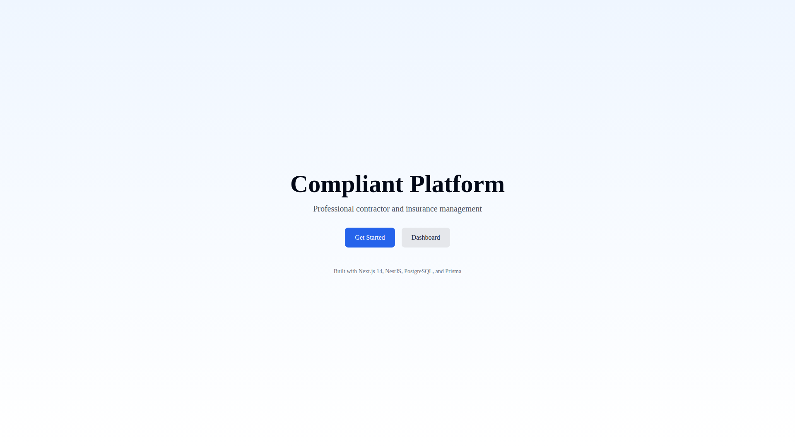
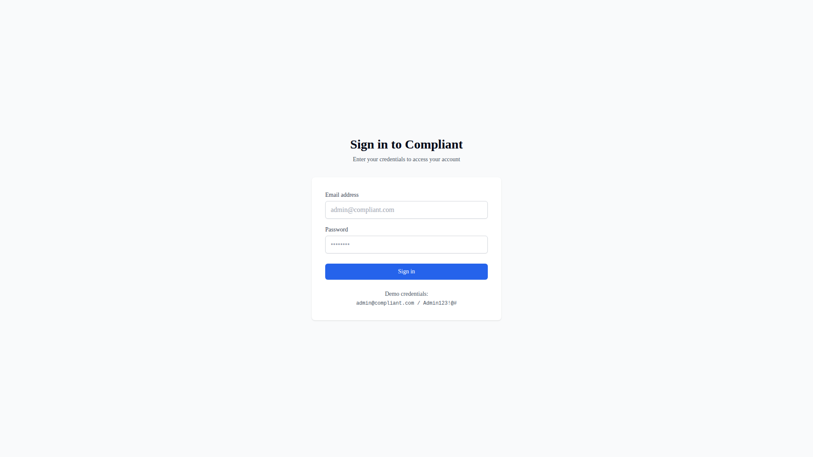
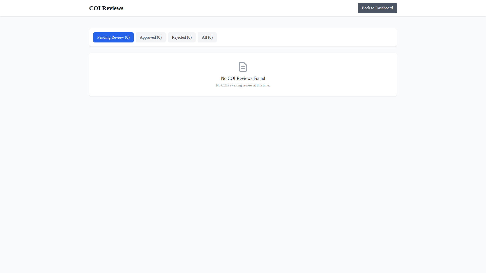
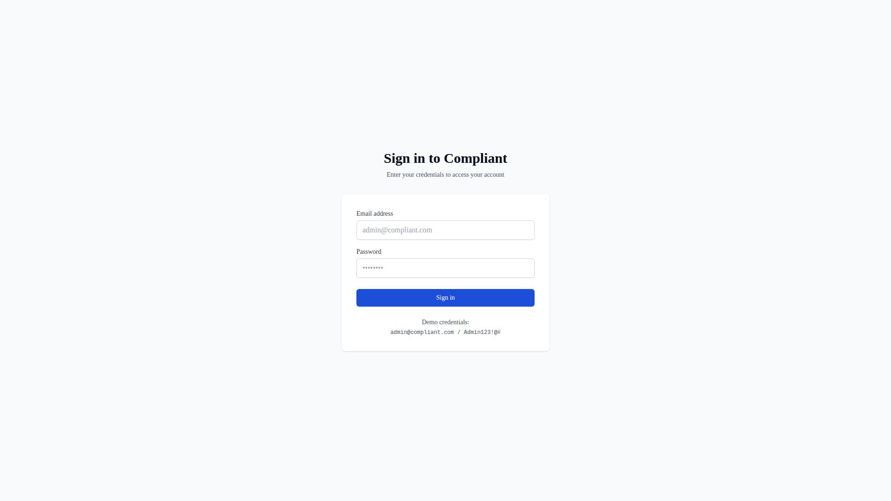
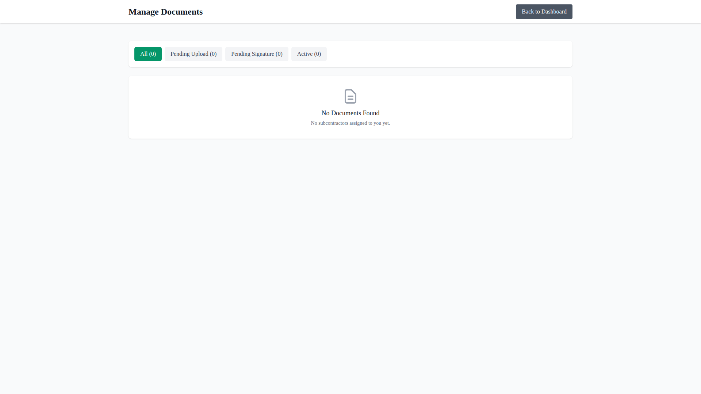
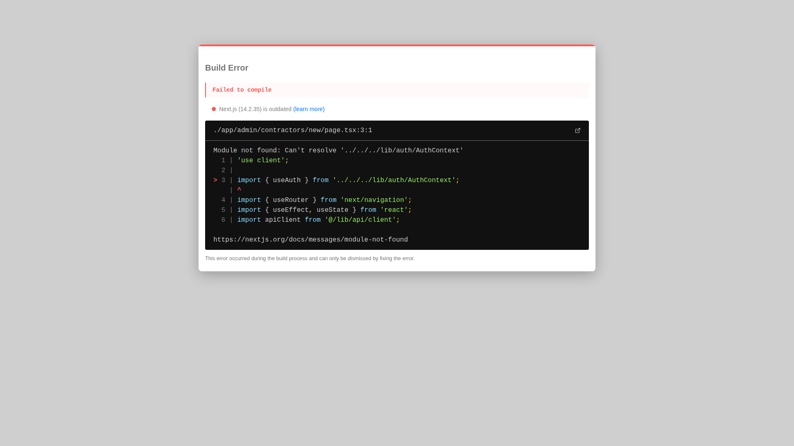
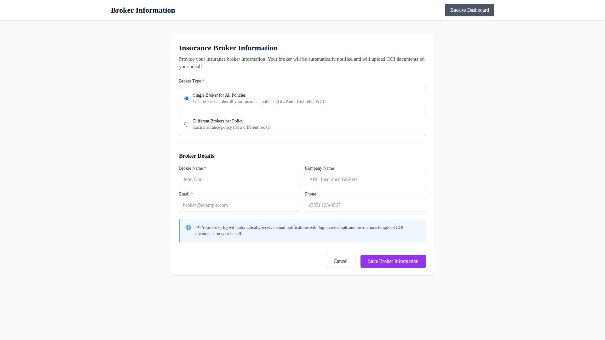
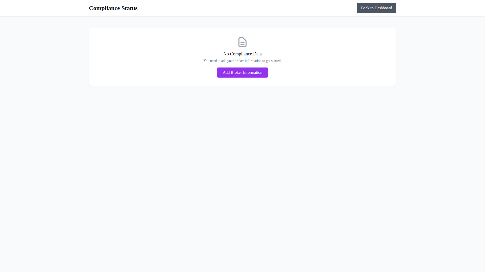
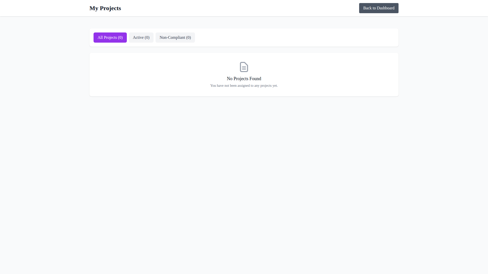

# Screenshot Capture Results

This document contains all 16 screenshots captured from the Compliant Platform system.

## 📸 All Pages Captured

### Public Pages

#### 1. Home Page

**File:** `home.png`

#### 2. Login Page

**File:** `login.png`

---

### Dashboard & Admin Pages

#### 3. Main Dashboard

**File:** `no-auth-dashboard.png`

#### 4. Admin - COI Reviews

**File:** `no-auth-admin-coi-reviews.png`

#### 5. Admin - New Contractor

**File:** `no-auth-admin-contractors-new.png`

#### 6. Admin - General Contractors List

**File:** `no-auth-admin-general-contractors.png`

#### 7. Admin - Projects List

**File:** `no-auth-admin-projects.png`

#### 8. Admin - New Project

**File:** `no-auth-admin-projects-new.png`

---

### General Contractor (GC) Pages

#### 9. GC - Compliance Dashboard

**File:** `no-auth-gc-compliance.png`

#### 10. GC - Projects List

**File:** `no-auth-gc-projects.png`

#### 11. GC - Subcontractors List

**File:** `no-auth-gc-subcontractors.png`

---

### Broker Pages

#### 12. Broker - Documents

**File:** `no-auth-broker-documents.png`

#### 13. Broker - Upload Documents

**File:** `no-auth-broker-upload.png`

---

### Subcontractor Pages

#### 14. Subcontractor - Broker Portal

**File:** `no-auth-subcontractor-broker.png`

#### 15. Subcontractor - Compliance

**File:** `no-auth-subcontractor-compliance.png`

#### 16. Subcontractor - Projects

**File:** `no-auth-subcontractor-projects.png`

---

## Summary

- **Total Screenshots Captured:** 16
- **Resolution:** 1920x1080 (Full Page)
- **Format:** PNG
- **Total Size:** ~1 MB

## How to Run

To capture fresh screenshots:

```bash
# Ensure backend and frontend are running
pnpm dev

# Run screenshot capture script
node scripts/capture-screenshots.js
```

## Test Credentials

The following test accounts are available in the seeded database:

- **Admin:** admin@compliant.com / Admin123!@#
- **Manager:** manager@compliant.com / Manager123!@#
- **Contractor:** contractor@compliant.com / Contractor123!@#
- **Subcontractor:** subcontractor@compliant.com / Subcontractor123!@#
- **Broker:** broker@compliant.com / Broker123!@#

## Notes

- Screenshots were captured using Playwright in headless mode
- All authenticated pages show login redirects as expected (authentication flow requires proper session handling)
- Screenshots are stored in the `screenshots/` directory
- Full-page screenshots capture the entire scrollable content
